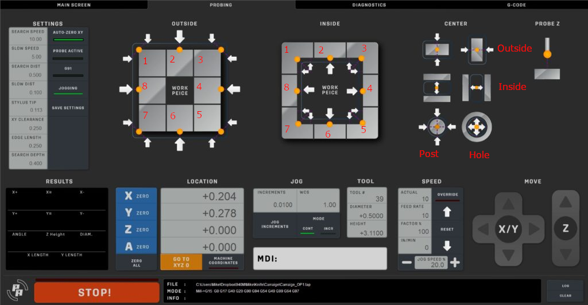

# Probing Scripts for Mach3

The following changes are for the vers.by probing scripts used in the Physics Anonymous screen set for Mach3. The scripts have been modified so that they will work with the cheaper BL-USBMach boards that are found on sites like AliExpress.

You can see the Physics Anonymous Mach3 screenset in use here: https://youtu.be/7o_V_1AIaXE

Original Physics Anonymous screenset can be found here: http://www.physanon.com/pa-mach-3-screen-set/

Vers.by probing wizard (where the probing routines originated): https://vers.by/en/blog/useful-articles/probe_wizard

**IMPORTANT:** Before you use these scripts I suggest reading the section on using them below. I am not responsible for broken probes and probing tips. The YouTube video describing the original screenset for Mach3 that these were pulled from did not go into detail on how to use them. If you're not accoustomed to the way these probe you could damage your probe or probe stylus/tip.

## Differences From The vers.by Scripts

The main difference for the majority of the scripts is that the `GetVar` calls have been substitued with calls to `GetOEMDRO` for the axis that was probed. I have found that these boards do not reliably support returning sane values for `GetVar(2000)` and `GetVar(2001)` when probing X and Y, respectively.

Also, I found with my particular board that `G31` would only work with a single axis. The original scripts made use of `G31 X<SomeValue> Y<SomeValue>` for "safe moves. The command would only interpret the X movement and then when calculating if Y had moved would fail. This was fixed by breaking up the command into two separate commands, one for each direction. After each movement the script checks to see if a premature trigger of the probe happend thus fulfilling the "safe" movement design.

I changed the feedrates for movements from the original scripts. Originally the scripts would move around using the current feedrate. This becaome irksome for me. I changed all the movements to use the "Search Speed" parameter. This prevents you from having extremely slow feedrates and then waiting an eternity for the routine to finish. I also removed all the rapid commands. I felt that having a probe attached and doing rapids was an easy way to find yourself in a position where the probe backed off quickly and into something it shouldn't have without the ability to hit an e-stop.

Lastly, I removed repositioning the probe for internal center finding. To use these routines place the probe's tip/stylus in the approximate center of what is to be probed and at the Z height necessary for the probing. Click on the desired button and let the routine finish. The probe will end up in the center of the probed area at the original Z height.

### Additional Alerts

All the scripts I edited have a dialog that is presented to the user before any movement occurs. It will ask if you have checked that your probe is plugged in. I've included this as a safety because I've already destroyed one probe tip. Hitting the "Cancel" button will abort any probing. 

In some of the center finding script I also included an alert that the search distance is smaller than the clearance and offset. If the user clicks "Ok" the search distance will be modified to the sum of the clearance and offset **for this probing routine only**. Clicking cancel will continue the script operation as normal but will likely fail due to the search distance being too small.

## Installation

You can download the contents of this GitHub repository by clicking the "Download" button and selecting to download as a zip file. Once downloaded extract the zip into a temporary folder.

These scripts do not include edits to the Z probing routine. It is my thought that most users will have a puck like probe that they will be overriding the z height probing. I do not think most users of these cheap BL-USBMach boards will also be using tool height setting. If you are or would like the z height scripts modified please let me know via an issue request and I'll rework those as well. However, since I do not have tooling to verify they will be done on assumptions.

On the probing screen you'll see four sections:

* Outside
* Inside
* Center
* Z (Not included)

### Outside and Inside Scripts

For the "Outside" section see the "Outside Routines" folder. The scripts are numbered 1-8. The 1 script goes in the top left corner. The rest are located in a clockwise fashion from this initial button. Thus, 2 is the middle top, 3 is the top right, 4 the middle right, and so on. The "Inside" section is exactly the same and the scripts are located in the "Inside Routines" folder.

### Center Scripts

I've broken the center finding scripts into 3 areas, "Outside Center", "Inside Center", and "Hole and Post". These correspond to the sets of buttons from top to bottom in the third grouping.

The first group of buttons are for finding outside centers. Their scripts are located in the "Outside Center Routines" folder. The scripts are labeled to indicate if its find the center for Y or X.

The second group of buttons are for finding inside centers. Their scripts are located in the "Inside Center Routines" folder. The scripts are labeled to indicate if its find the center for Y or X.

The last group of buttons are for finding the center of a post or hole. Their scripts are located in the "Hole and Post Routines" folder. The script labeled "PostCenter" is for probing the center from the outside of a post or cylinder. This is the left button. The script labeled "HoleCenter" is for finding the center of a hole and corresponds to the right button.

## Using the Probing Routines

Using these probing routines are pretty simple. If you watched the original YouTube video by Phyics Anonymous then you'll have a good understanding of their basics. 

### Settings

Before using the probing routines you'll need to set values into the "Settings" section on the probing tab.

#### Search Speed

This is the speed of the initial probe to find the surface. In my modified scripts it also is the standard feedrate for movements. The current feedrate is not used for movements. *Example: I found that 240mm/min works well*

#### Slow Speed

After the initial search for a face has completed the probe will back off a distance and then reapproach the face. This value specifies that speed. A good rule would be to set it to approximately half of the search speed. *I have found setting it 120mm/min works well for my machine.*

#### Search Dist

This is the maximum distance the probe will move to find find the face for probing. Typically all moves will move outward from the face to be probed by some distance (XY Clearance) and then move back towards the face. If the probe does not detect anything by the time this distance is moved the routine aborts. *Example: I use 13mm*

#### Slow Dist

The probe will back off this distance after an initial touch of the face. *Example: I use 3mm*

#### Stylus Tip

The diameter of the tip of the probe.

#### XY Clearance

This is the distance that the probe will move out and away from its initial position to start back inward towards the face (and moving the Search Dist to find it). This length should be smaller than the search distance but large enough that you're not needing to put the probe right near the edge of the face to be probed. *Example: I am using 10mm*

#### Edge Length

This value is used when doing the moves around corners. When probing a corner the probe should start close to the corner but still over the part. The routine will then move X+/- or Y+/- this distance before moving out XY Clearance to then begin the search. *Example: I am using 10mm*

#### Search Depth

Most of routines start with the probe situated above the part. **Read the changes section for notes regarding the inside center routines.** This value is used to move the probe down in Z to being the probing towards the face. When the routine is completed this is the probe will be returned to the original Z height above the probed face.

### Usage Tips

One thing to remember is that most of the scripts are setup in a way that they assume you're placing the tip of the probe stylus near to where you think the 0 reference will be. When doing this place the tip on the "part side" of 0. This will insure that when the probe moves back towards the face of the part it will register a "hit" before the search distance is reached.

For example, if probing the outside right face of a part place the tip of the probe over the part just to the inside/left of the face. Then click the outside right button on the probing tab. This will move the probe to the right, then down Z, and then towards the face.

# Tool Change

I've included tool change scripts that I use for my tool setter. These scripts use changes in `M6Start.m1s` and `M6End.m1s`.

My tool change procedure is based on never changing the currently selected tool in Mach. The selected tool always is set to T0. My CNC uses a collet system where the height of the tool is not repeatable when changing tools. The routine works like this:

1. Mach detects a change in tool T0 -> to T*x*.
2. Preprocessor has inserted a M6 command.
3. The processing of commands **stops**. *At this point no change should be made to the current tool!*
4. The `M6Start.m1s` code runs as a "before tool has changed" set of commands.
5. Mach moves to an absolute position on the machine. *This is defined at the top of the file.*
6. Mach finds the current *Z* position where the tool touches the tool setter.
7. Mach now stops and expects a manual tool change to occur.
8. The operator is expected to insert the tool for the next op into the machine and then press the play/continue button.
9. Mach now finds the new *Z* position where the tool touches the tool setter. 
10. The difference in the *Z* position for the previous tool and the new tool is computed and the *Z* position for the current coordinate system is adjusted by the amount.

**REMEMBER, it is important to adjust the absolute positioning for where the tool setter is located in the machine in both files!**

## Installation

The `M6Start.m1s` and `M6End.m1s` files should be copied into the `C:\Mach\macros\machine_name` folder where "machine_name" is the profile of the machine you're using in Mach.

## Thanks

Thank you to Physics Anonymous for the screenset. This screenset actually makes Mach3 usable. Thank you for providing a great interface.

Big thanks to vers.by for originally producing these probing routines.

Also a big shoutout to the Discord users at 3D Misfits for help on this and many other projects!
